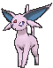
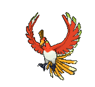
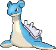
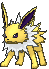
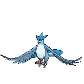
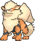
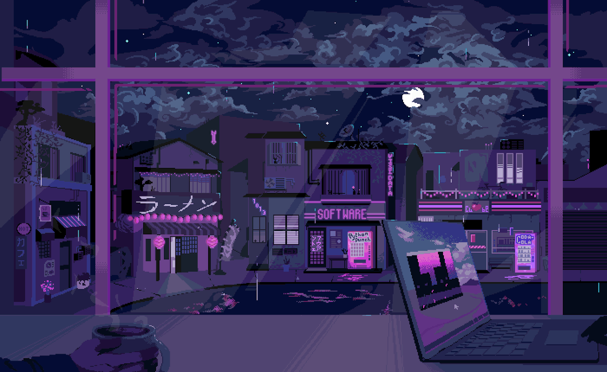

<h1>Oii, eu me chamo Evilen Barreto!</h1>

No momento me encontro realizando graduação, cursando Análise e Desenvolvimento de Sistemas na UniGrande. Sou Designer Gráfica quando estou disponível, e continuo aprimorando meus conhecimentos sobre TI de forma geral, com foco maior em Arte 3D.

## Linguagens com Experiência

  
  &nbsp
  &nbsp
  
  

## Frameworks Integrados

   &nbsp
  

## Editores de código e IDEs

  
  

## Sistemas Operacionais(SO) Explorados

  
  

### Redes Sociais

  
  
  
  
   
  

  ### Pokémons Favoritos 
  

    
    &nbsp
    &nbsp
    &nbsp
    
    
    &nbsp
    
  

 

  

  

 

## 

<picture>
    <source media="(prefers-color-scheme: dark)" srcset="https://raw.githubusercontent.com/roseofcodes/roseofcodes/output/pacman-contribution-graph-dark.svg">
    <source media="(prefers-color-scheme: light)" srcset="https://raw.githubusercontent.com/roseofcodes/roseofcodes/output/pacman-contribution-graph.svg">
    
</picture>

  

 

